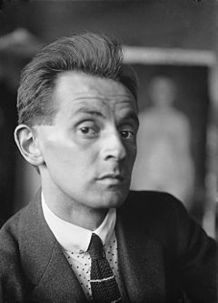
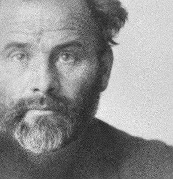
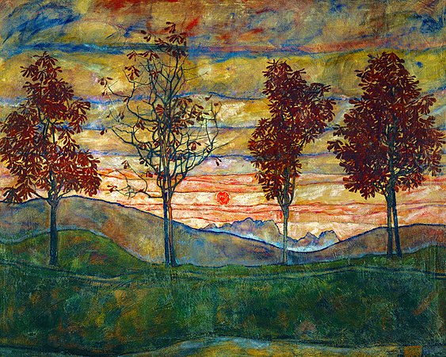
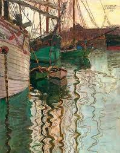
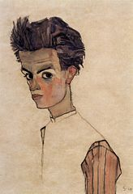
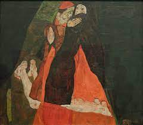
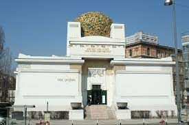

# Egon Schiele 👍

Né dans le petit village de Tulln an der Donau, près de Vienne, Egon Schiele appartient à une famille modeste de cheminots et d'artisans. Son enfance est très agitée, marquée par la mort d'abord de sa sœur, puis de son père, pour lequel il éprouvait un grand attachement. La disparition de son père sera pour lui un traumatisme durable qui lui donnera une vision sombre et désabusée du monde.

Dès son plus jeune âge, il se montre doué pour le dessin, auquel il aime s'adonner dans son temps libre : il commence déjà à faire ses autoportraits. D'abord orienté vers une carrière dans les chemins de fer, il embrasse sa véritable passion et entre à l'Académie des beaux-arts de Vienne en 1906. Cependant, il est vite déçu par l'enseignement qui y est dispensé, trop traditionnel, trop rigide et convenu.

Avec plusieurs camarades, il quitte l'école pour fonder un groupe d'artistes « pour le nouvel art ». Il fréquente Gustav Klimt, artiste alors déjà reconnu, qui devient vite son ami et son père spirituel. Malgré cette influence, il développe un style très personnel, très différent des autres artistes de la capitale.

Egon Schiele peint des paysages, des marines, mais surtout de nombreux autoportraits. À partir de 1910, il s'intéresse aux femmes sous un angle parfois érotique. Ses toiles provocatrices lui apportent une grande notoriété, mais elles choquent la bourgeoisie viennoise. Accusé de fréquenter des prostituées, il est jeté en prison en 1912 pour outrage à la morale publique.

En prison, Egon Scheile enrage : sa haine de la bourgeoisie n'en est qu'encore plus grande. Dès sa sortie de prison, il peint le Cardinal et la Nonne, représentant les désirs interdits entre deux religieux. Désormais, contrairement à son mentor Gustav Klimt qui sublime les amants, sa vision de l'amour est froide, cruelle, endolorie, presque morbide.

Schiele connaît une reconnaissance tardive au nouveau palais de la Sécession, où il peut présenter cinquante de ses tableaux dans une grande exposition. En 1918, alors que son maître se meurt, Egon Schiele peint Gustav Klimt qu'il a tant admiré. Il ne tardera pas à le rejoindre : la même année, la grippe espagnole l'emporte ainsi que sa femme enceinte. Egon Schiele meurt à seulement 28 ans. 

**Egon Schiele:**
 

**Gustav Klimt:**
 

**Paysage de Egon Schiele:**
 

**Tableau de marine de Egon Schiele:**
 

**Tableau d'autoportrait de Egon Schiele:**
 

**le Cardinal et la Nonne:**
 

**Palais de la Sécession:**
 

> #### Définitions;
>
> - **cheminots:** Employé, employée des chemins de fer.
> - **désabusée:** Qui a perdu ses illusions.
> - **spirituel:** Qui est de l'ordre de l'esprit, considéré comme distinct de la matière.
> - **notoriété:** Fait d'être connu avantageusement.
> - **endolorie:** Envahi par une douleur diffuse.
> - **morbide:** Relatif à la maladie. ; Anormal, dépravé.
> - **prostituées:** Personne qui consent habituellement à pratiquer des rapports sexuels avec un nombre indéterminé d'autres personnes moyennant une rémunération.
