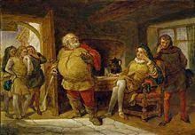
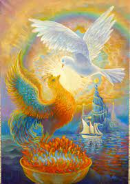

# William Shakespeare 👍

William Shakespeare est un poète, dramaturge et comédien anglais, né en 1564, et mort en 1616.

Il a écrit notamment Roméo et Juliette, une des plus grandes pièces de théâtre, dont la première représentation a eu lieu le 29 janvier 1593 et Hamlet, la plus longue de ses tragédies.

Il a également écrit une seule comédie (La Nuit des rois), des pièces historiques (Henri IV), des poèmes (Le Phénix et la colombe ou Le Viol de Lucrèce) et des tragédies (Roméo et Juliette).

**Roméo et Juliette:**
 

**La Nuit des rois:**
 

**Henri IV:**
 

**Le Phénix et la colombe ou Le Viol de Lucrèce:**
 

> #### Définitions;
>
> - **Dramaturge:** Auteur d'ouvrages destinés au théâtre.
> - **Comédien:** Un acteur, une actrice, un comédien, ou une comédienne, est un artiste qui prête son physique ou sa voix à un personnage fictif dans une pièce de théâtre, dans un film, à la télévision, ou à la radio.

