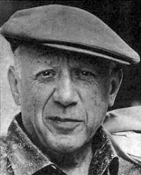
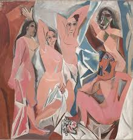

# Pablo Picasso

Pablo Picasso (Pablo Ruiz Picasso, Picasso étant le nom de sa mère) est un artiste peintre et sculpteur né à Málaga en Espagne en 1881. Il a vécu en France jusqu'à sa mort le 8 avril 1973.

Pablo Picasso est l'un des peintres les plus importants du XXe siècle. Il a réalisé aux alentours de « 1 885 tableaux, 1 228 sculptures, 2 880 céramiques, 7 089 dessins, 342 tapisseries, 150 carnets de croquis et 30 000 estampes (gravures, lithographies, etc.) »1. Il est l'un des plus célèbres artistes du XXe siècle et on dit généralement que son œuvre a changé le cours de l'art moderne. Il est d'ailleurs le premier à avoir exposé de son vivant au musée du Louvre à Paris. Il avait alors 91 ans. 

Dessinateur virtuose, initiateur du cubisme, peintre surréaliste, sculpteur… Pablo Picasso a profondément bouleversé l’art du XXe siècle. Sa grandeur s’explique par sa capacité infinie à innover, à devancer ses contemporains tout en dialoguant avec la peinture des maîtres anciens. L’artiste a constamment renouvelé le rapport de l’art à la réalité, à l’histoire. Les Demoiselles d’Avignon (1907) et Guernica (1937) comptent parmi les œuvres les plus importantes du siècle. Picasso incarne aussi un mythe : l’artiste bohème, le démiurge. Devenu une star de son vivant, mort à l’âge de 91 ans, Picasso fut auréolé d’une gloire internationale. Pour toutes ces raisons, il est communément qualifié de génie.

**Pablo Picasso:**
 

**Les Demoiselles d’Avignon:**
 

**Guernical:**
 

> #### Définitions;
>
> - **Bohème:** La bohème est une façon de vivre au jour le jour dans la pauvreté mais aussi dans l’insouciance. Elle correspond à un mouvement littéraire et artistique du XIXᵉ siècle, en marge du mouvement romantique plus « aristocratique ».
> - **Démiurge:** Le démiurge, ou le créateur, est la déité responsable de la création de l'univers physique dans diverses cosmogonies. Il peut désigner par extension tout créateur d'une œuvre.
